决策树就是用一棵树来表示我们的整个决策过程。这棵树可以是二叉树（比如 CART 只能是二叉树），也可以是多叉树（比如 ID3、C4.5 可以是多叉树或二叉树）。

决策树学习的算法通常是递归的选择最优特征，并根据该特征对训练数据进行分割，使得对各个子数据集有一个最好的分类的过程，这一过程对应着特征空间的划分，也对应着决策树的构建。

决策树的三个步骤：特征选择、决策树的生成、决策树的修剪。

分类过程：
-----

分而治之策略

从根节点开始，对实例的某一特征进行测试，根据测试结果，将实例分配到其子结点，此时，每个子结点对应着该特征的一个取值，如此递归地对实例进行测试并分配，直到达到叶结点，最后将实例分到叶结点的类中。

递归返回的条件：

1\. 当前结点包含的样本全属于同一类别

2\. 当前属性集为空，或是所有样本在所有属性上取值相同

3\. 当前结点包含样本集合为空

根节点包含整个样本集，每个叶结点都对应一个决策结果（注意，不同的叶节点可能对应同一个决策结果），每一个内部节点都对应一次决策过程或者说是一次属性测试。从根节点到每个叶节点的路径对应一个判定测试序列。

决策树学习的本质：从训练集中归纳出一组分类规则，或者说是由训练数据集估计条件概率模型。

决策树学习的损失函数：正则化的极大似然函数

**决策树的构造过程**：
-------------

构建根节点，将所有训练数据都放在根节点，选择一个最优特征，按着这一特征将训练数据集分割成子集，使得各个子集有一个在当前条件下最好的分类。

如果这些子集已经能够被基本正确分类，那么构建叶节点，并将这些子集分到所对应的叶节点去。

如果还有子集不能够被正确的分类，那么就对这些子集选择新的最优特征，继续对其进行分割，构建相应的节点，如果递归进行，直至所有训练数据子集被基本正确的分类，或者没有合适的特征为止。

每个子集都被分到叶节点上，即都有了明确的类，这样就生成了一颗决策树。

特征选择准则：

--------

1、信息

信息是用来消除随机不确定性的东西如果带分类的事物集合可以划分为多个类别当中，则某个类（xi）的信息定义如下: 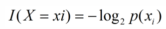

2、熵

内部的混乱程度

随着树深度的增加，节点的熵迅速下降

熵是对随机变量不确定性的度量，熵便是信息的期望值，可以记作：

 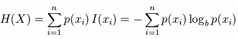

熵只依赖X的分布，和X的取值没有关系，熵是用来度量不确定性，当熵越大即这个类别的不确定性更大，反之越小，当随机变量的取值为两个时，熵随概率的变化曲线如下图：

 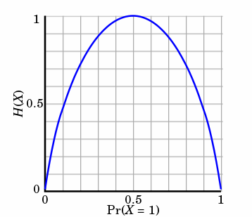

当p=0或p=1时，H(p)=0,随机变量完全没有不确定性，当p=0.5时，H(p)=1,此时随机变量的不确定性最大

条件熵
---

概率定义：随机变量X在给定条件下随机变量Y的条件熵，对定义描述为：X给定条件下Y的条件概率分布的熵对X的数学期望，在机器学习中为选定某个特征后的熵，公式如下：

 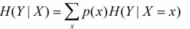

3、信息增益

信息增益在决策树算法中是用来选择特征的指标，信息增益越大，则这个特征的选择性越好，在概率中定义为：待分类的集合的熵和选定某个特征的条件熵之差（这里只的是经验熵或经验条件熵，由于真正的熵并不知道，是根据样本计算出来的），公式如下：

 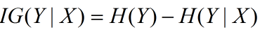

在划分数据集之前之后信息发生的变化（也就是熵的变化）称为信息增益，分别计算每个特征值划分数据集获得的信息增益，选择信息增益最高的特征作为划分特征。

​信息增益的计算：

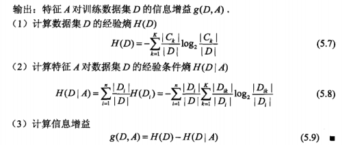

决策树的剪枝：
-------

从已经生成的树上裁掉一些子树或叶节点，并将其根节点或父节点作为新的叶子节点，从而简化分类树模型，防止过拟合，提高泛化性能。

\*\*实现方式：\*\*极小化决策树整体的损失函数或代价函数来实现

剪枝分为预剪枝与后剪枝：

预剪枝：是指在决策树的生成过程中，对每个节点在划分前先进行评估，若当前的划分不能带来泛化性能的提升，则停止划分，并将当前节点标记为叶节点。

后剪枝：是指先从训练集生成一颗完整的决策树，然后自底向上对非叶节点进行考察，若将该节点对应的子树替换为叶节点，能带来泛化性能的提升，则将该子树替换为叶节点。

即预留一部分数据作为验证集来进行性能评估。

1） ID3：使用信息增益作为选择特征的准则（处理离散属性）
------------------------------

首先是针对当前的集合，计算每个特征的信息增益

然后选择信息增益最大的特征作为当前节点的决策特征

根据特征不同的类别划分到不同的子节点（比如年龄特征有青年，中年，老年，则划分到3颗子树）

然后继续对子节点进行递归，直到所有特征都被划分

核心：在决策树的各个结点上应用信息增益来选择特征，递归的构建决策树。ID3相当于用极大似然法进行概率模型的选择

构建方法：从根节点（root node）开始，对结点计算所有可能的特征信息增益，选择信息增益最大的特征作为结点的特征，由该特征的不同取值建立子结点，再对子结点递归的调用此方法，构建决策树，知道所有特征的信息增益均很小，或没有特征可以选择为止。

信息增益=划分前的熵 - 划分后的熵

信息增益越大，则利用属性A划分后的纯度提升越大

ID3仅仅适用于二分类问题，仅仅能够处理离散属性

算法生成的决策树是一棵多叉树，分支的数量取决于分裂属性有多少个不同的取值

可以是二叉树或多叉树

算法步骤：
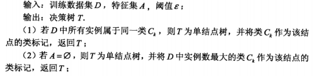
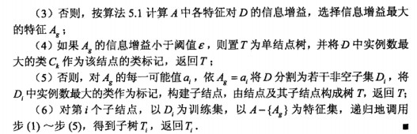

示例：
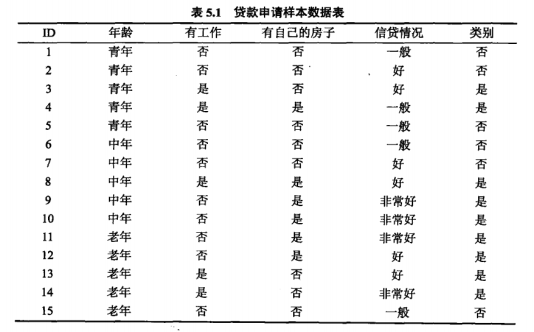
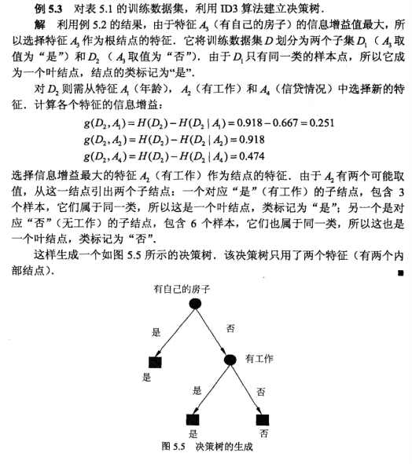

损失函数：

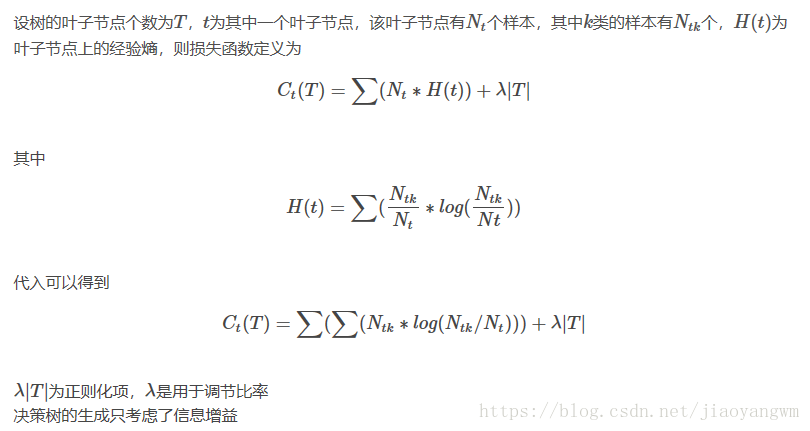

2） C4.5：使用信息增益比作为选择特征的准则 (处理连续属性）
---------------------------------

信息增益比=信息增益 / 固有值（该特征的熵）

信息增益相对于信息增益比的一个缺点：信息增益总是偏向于选择取值较多的属性。信息增益比在此基础上增加了一个罚项，解决了这个问题。

C4.5克服了ID3仅仅能够处理离散属性的问题，以及信息增益偏向选择取值较多特征的问题，使用信息增益比来选择特征。

二分法对**连续属性**进行处理

属性的可能取值越多，则分母值越大。

先从候选属性中找出信息增益高于平均水平的属性，再从中选择增益率最高的。

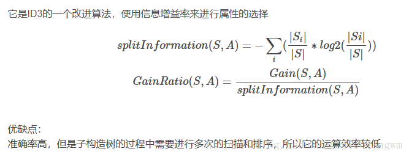
3）CART（分类与回归树）：使用 Gini 指数作为选择特征的准则

CART与上述两者不同的地方在于，CART生成的树必须是二叉树，也就是无论回归还是分类，无论特征离散还是连续，无论属性取值有多个还是两个，内部节点只能根据属性进行二分。

CART作为回归树：使用平方误差最小准则来选择特征并进行划分，也叫最小二乘回归树。

CART作为分类树：使用Gini指数最小化准则来选择特征并进行划分

Gini 指数表示集合的不确定性，或者是不纯度。基尼指数越大，集合不确定性越高，不纯度也越大。基尼指数是为了最小化误分类的概率。

Gini指数和熵的区别：Gini指数计算不需要对数运算，更加高效，且更偏向于连续属性，熵更偏向于离散属性。

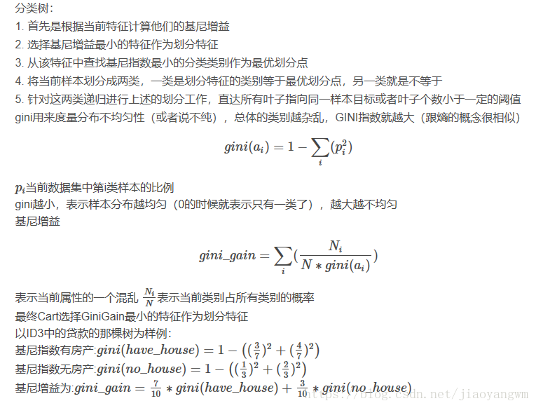

决策树的分类与回归：

分类树 ：输出叶子节点中所属类别最多的那一类

回归树 ：输出叶子节点中各个样本值的平均值

决策树的优缺点：
--------

优点：

计算量简单，可解释性强，比较适合处理有缺失属性值的样本，能够处理不相关的特征；

缺点：

单颗决策树分类能力弱，并且对连续值变量难以处理；

容易过拟合；

总结：

决策树算法主要包括三个部分：特征选择、树的生成、树的剪枝。常用算法有 ID3、C4.5、CART。

特征选择：特征选择的目的是选取能够对训练集分类的特征。特征选择的关键是准则：信息增益、信息增益比、Gini 指数；

决策树的生成：通常是利用信息增益最大、信息增益比最大、Gini 指数最小作为特征选择的准则。从根节点开始，递归的生成决策树。相当于是不断选取局部最优特征，或将训练集分割为基本能够正确分类的子集；

决策树的剪枝：决策树的剪枝是为了防止树的过拟合，增强其泛化能力。包括预剪枝和后剪枝。

缺失值处理
-----

C4.5:

测试样本在该属性值上有缺失值，那么就同时探查（计算）所有分支，然后算每个类别的概率，取概率最大的类别赋值给该样本。