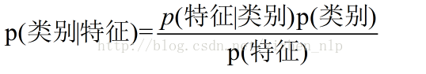
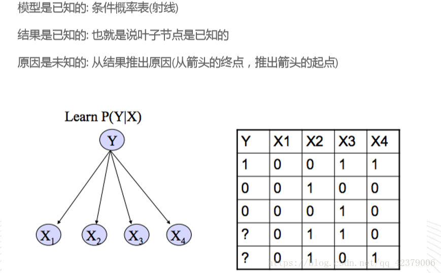
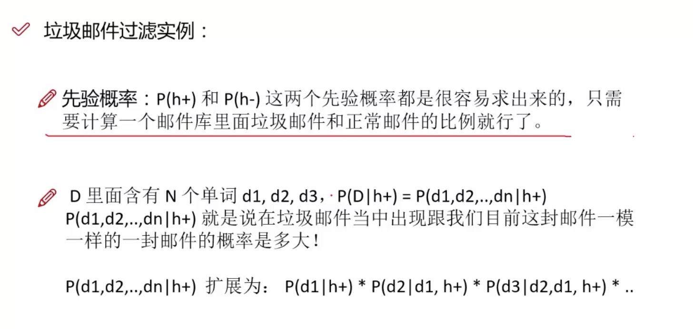
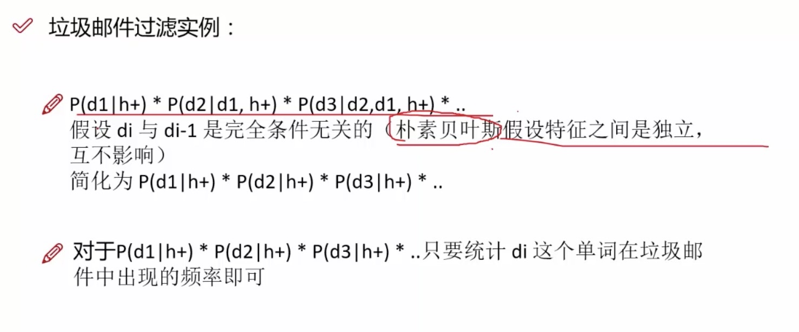
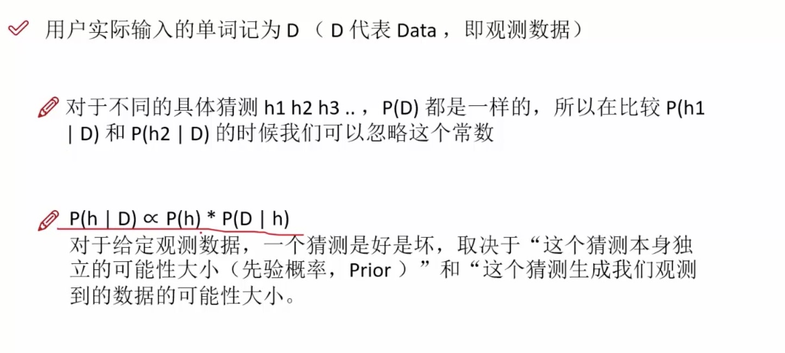
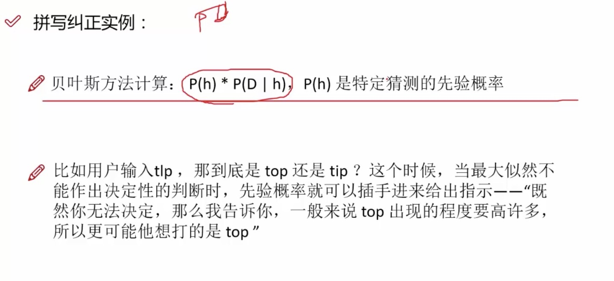

朴素贝叶斯原理简单，也很容易实现

在统计资料的基础上，依据某些特征，计算各个类别的概率，从而实现分类。

在大量样本下会有较好的表现，不适用于输入向量的特征条件有关联的场景。

“朴素”：特征与特征之间是独立的，互不干扰。如果特征比较多时，往往独立性的条件不重要（互相抵消），可以用朴素贝叶斯。

P（类别）为先验概率

应用场景：源于推理的需要，例如：通过商品的描述（特征X）来推理商品的类别（Y）。

训练的时候：得出条件概率表 
推理的时候：比较条件概率的大小 
特点：训练容易，推理难

拼写纠正：

垃圾邮件检测：

P(D) 这个词在邮件中出现的概率

P（D/H+) 当他是垃圾邮件时，里面是这些词的概率

单词拼写纠错：

### 朴素贝叶斯模型

朴素贝叶斯常用的三个模型有：

* 高斯模型：处理特征是连续型变量的情况
* 多项式模型：最常见，要求特征是离散数据
* 伯努利模型：要求特征是离散的，且为布尔类型，即true和false，或者1和0

