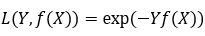

Boosting提升算法
------------

在算法开始的时候，为每一个样本赋上一个权重值，初始的时候，大家都是一样重要的。

AdaBoost是典型的Boosting算法。

Boosting算法是将“弱学习算法“提升为“强学习算法”的过程，一般来说，找到弱学习算法要相对容易一些，然后通过反复学习得到一系列弱分类器，组合这些弱分类器得到一个强分类器。

Boosting算法要涉及到两个部分，加法模型和前向分步算法。

加法模型就是说强分类器由一系列弱分类器线性相加而成。一般组合形式如下：

FM(x;P)=∑m=1nβmh(x;am)FM(x;P)=∑m=1nβmh(x;am)

其中，h(x;am)h(x;am) 就是一个个的弱分类器，amam是弱分类器学习到的最优参数，βmβm就是弱学习在强分类器中所占比重，PP是所有amam和βmβm的组合。这些弱分类器线性相加组成强分类器。

**前向分步**就是说在训练过程中，下一轮迭代产生的分类器是在上一轮的基础上训练得来的。也就是可以写成这样的形式：

Fm(x)=Fm−1(x)+βmhm(x;am)Fm(x)=Fm−1(x)+βmhm(x;am)

由于采用的损失函数不同，Boosting算法也因此有了不同的类型，AdaBoost就是损失函数为指数损失的Boosting算法。

如何学习
----

AdaBoost改变了训练数据的权值，也就是样本的概率分布，其思想是将关注点放在被错误分类的样本上，减小上一轮被正确分类的样本权值，提高那些被错误分类的样本权值。然后，再根据所采用的一些基本机器学习算法进行学习，比如逻辑回归

弱分类器权值的确定
---------

AdaBoost采用加权多数表决的方法，加大分类误差率小的弱分类器的权重，减小分类误差率大的弱分类器的权重。

Gradient Boost与AdaBoost的区别
==========================

* adaboost通过给已有模型预测错误的样本更高的权重，使得先前被学习错误的样本可以在后续的训练中得到更高的关注来弥补原有模型的不足；

  gradient boost则是通过每次迭代的时候构建一个沿梯度下降最快的方向的学习器来弥补模型的不足。

  AdaBoost算法只能处理采用指数损失函数的二分类学习任务，

  而梯度提升方法通过设置不同的可微损失函数可以处理各类学习任务（多分类、回归、Ranking等），应用范围大大扩展。

  另一方面，AdaBoost算法对异常点（outlier）比较敏感，而梯度提升算法通过引入bagging思想、加入正则项等方法能够有效地抵御训练数据中的噪音，具有更好的健壮性。

  GBDT每次通过按比例（推荐[0.5, 0.8] 之间）随机抽取部分样本来训练模型，这种方法有点类似Bagging，可以减小方差，但同样会增加模型的偏差，可采用交叉验证选取，这种方式称为子采样。

