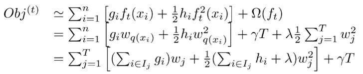
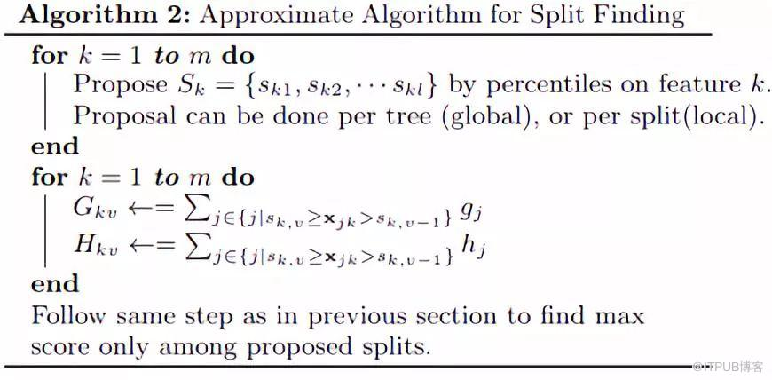

GBDT
====

GBDT是梯度提升决策树。**GBDT分类和回归时的基学习器都是CART回归树，因为是拟合残差的。**GBDT和Adaboost一样可以用前向分布算法来描述，

gradient boost则是通过每次迭代的时候构建一个沿梯度下降最快的方向的学习器来弥补模型的不足。

不同之处在于Adaboost算法每次拟合基学习器时，输入的样本数据是不一样的（每一轮迭代时的样本权重不一致），

因为Adaboost旨在重点关注上一轮分类错误的样本，GBDT算法在每一步迭代时是输出的值不一样，本轮要拟合的输出值是之前的加法模型的预测值和真实值的差值（模型的残差，也称为损失）。

以平方误差损失函数的回归问题为例，采用前向分布算法：

 

 在第mm次迭代时，我们要优化的损失函数：

 

 此时我们采用平方误差损失函数为例：

 

 则上面损失函数变为：

 

 问题就成了对残差r的拟合了

 然而对于大多数损失函数，却没那么容易直接获得模型的残差，针对该问题，大神Freidman提出了用损失函数的负梯度来拟合本轮损失的近似值，拟合一个回归树

 

 关于GBDT一般损失函数的具体算法流程如下：

 1）初始化f0(x)f0(x)：

 

 2）第
m次迭代时，计算当前要拟合的残差rmirmi：

 

 以rmirmi为输出值，对rmirmi拟合一个回归树（**此时只是确定了树的结构，但是还未确定叶子节点中的输出值**），然后通过最小化当前的损失函数，并求得每个叶子节点中的输出值cmjcmj，jj表示第jj个叶子节点

 

 更新当前的模型fm(x)fm(x)为：

 

 3）依次迭代到我们设定的基学习器的个数MM，得到最终的模型，其中MM表示基学习器的个数，JJ表示叶子节点的个数

 

 GBDT算法提供了众多的可选择的损失函数，通过选择不同的损失函数可以用来处理分类、回归问题，比如用对数似然损失函数就可以处理分类问题。大概的总结下常用的损失函数：**
**

 1）对于分类问题可以选用指数损失函数、对数损失函数。

 2）对于回归问题可以选用均方差损失函数、绝对损失函数。

 3）另外还有huber损失函数和分位数损失函数，也是用于回归问题，可以增加回归问题的健壮性，可以减少异常点对损失函数的影响。

**3、GBDT的正则化**

 在Adaboost中我们会对每个模型乘上一个弱化系数（正则化系数），减小每个模型对提升的贡献（**注意：这个系数和模型的权重不一样，是在权重上又乘以一个0,1之间的小数**），在GBDT中我们采用同样的策略，对于每个模型乘以一个系数λ (0 \< λ ≤ 1)，降低每个模型对拟合损失的贡献，这种方法也意味着我们需要更多的基学习器。

 第二种是每次通过按比例（推荐[0.5, 0.8] 之间）随机抽取部分样本来训练模型，这种方法有点类似Bagging，可以减小方差，但同样会增加模型的偏差，可采用交叉验证选取，这种方式称为子采样。采用子采样的GBDT有时也称为随机梯度提升树（SGBT）。

 第三种就是控制基学习器CART树的复杂度，可以采用剪枝正则化。

**4、GBDT的优缺点**

 GBDT的主要**优点**：

 1）可以灵活的处理各种类型的数据

 2）预测的准确率高

 3）使用了一些健壮的损失函数，如huber，可以很好的处理异常值

 GBDT的**缺点**：

 1）由于基学习器之间的依赖关系，难以并行化处理，不过可以通过子采样的SGBT来实现部分并行。

 2) GBDT基于错误样本来建立提升树，当样本中有异常值outlier的时候，GBDT容易发生过拟合；

算法每次迭代生成一颗新的决策树 
2\. 在每次迭代开始之前，计算损失函数在每个训练样本点的一阶导数gi和二阶导数hi 
3\. 通过贪心策略生成新的决策树，通过等式(7)计算每个叶节点对应的预测值 
4\. 把新生成的决策树ft(x)添加到模型中：ŷ ti=ŷ t−1i+ft(xi)

GBDT是如何衡量特征的重要性:
----------------

计算所有的非叶子节点在分裂时加权不纯度的减少，减少得越多说明特征越重要。

不纯度的减少实际上就是该节点此次分裂的收益，因此我们也可以这样理解，节点分裂时收益越大，该节点对应的特征的重要度越高。

XGBoost
=======

XGBoost是一种提升树模型，所以它是将许多树模型集成在一起，形成一个很强的分类器。而所用到的树模型则是CART回归树模型。

**一、CART回归树**
-------------

CART回归树是假设树为二叉树，通过不断将特征进行分裂。比如当前树结点是基于第j个特征值进行分裂的，设该特征值小于s的样本划分为左子树，大于s的样本划分为右子树。

而CART回归树实质上就是在该特征维度对样本空间进行划分，而这种空间划分的优化是一种NP难问题，因此，在决策树模型中是使用启发式方法解决。典型CART回归树产生的目标函数为：

因此，当我们为了求解最优的切分特征j和最优的切分点s，就转化为求解这么一个目标函数：

所以我们只要遍历所有特征的的所有切分点，就能找到最优的切分特征和切分点。最终得到一棵回归树。

**二、XGBoost算法思想**

该算法思想就是不断地添加树，不断地进行特征分裂来生长一棵树，每次添加一个树，其实是学习一个新函数，去拟合上次预测的残差。当我们训练完成得到k棵树，我们要预测一个样本的分数，其实就是根据这个样本的特征，在每棵树中会落到对应的一个叶子节点，每个叶子节点就对应一个分数，最后只需要将每棵树对应的分数加起来就是该样本的预测值。

**2.1 定义树的复杂度**

 首先把树拆分成结构部分qq和叶子节点输出值
w，在这里ww是一个向量，表示各叶子节点中的输出值。在这里就囊括了上面提到的两点，确定树结构qq和叶子结点的输出值ww。从下图中可以看出，q(x)q(x)实际上是确定输入值最终会落到哪个叶子节点上，而ww将会给出相应的输出值。

 

具体表现示例如下，引入正则化项 Ω(ft)Ω(ft)来控制树的复杂度，从而实现有效的控制模型的过拟合，**这是xgboost中的第一个重要点。**

**式子中的TT为叶子节点数**

 

**5.2 XGBoost中的Boosting Tree模型**

 

 和GBDT方法一样，XGBoost的提升模型也是采用残差，不同的是分裂结点选取的时候不一定是最小平方损失，其损失函数如下，较GBDT其根据树模型的复杂度加入了一项正则化项：

 

**5.3 对目标函数进行改写**

 

 上面的式子是通过泰勒展开式将损失函数展开为具有二阶导的平方函数。

 在GBDT中我们通过求损失函数的负梯度（一阶导数），利用负梯度替代残差来拟合树模型。在XGBoost中直接用泰勒展开式将损失函数展开成二项式函数（**前提是损失函数一阶、二阶都连续可导，而且在这里计算一阶导和二阶导时可以并行计算**），假设此时我们定义好了树的结构（在后面介绍，和GBDT中直接用残差拟合不同），假设我们的叶节点区域为：
-------------------------------------------------------------------------------------------------------------------------------------------------------------------------

 

 上面式子中ii代表样本ii，jj代表叶子节点jj。

 则我们的目标优化函数可以转换成（因为l(yi,yt−1i)l(yi,yit−1)是个已经确定的常数，可以舍去）：

 

 上面式子把样本都合并到叶子节点中了。

 此时我们对wjwj求导并令导数为0，可得：

  

 其中 Gj=∑i∈Ijgi,Hj=∑i∈TjhjGj=∑i∈Ijgi,Hj=∑i∈Tjhj。 

**5.4 树结构的打分函数**

 上面的Obj值代表当指定一个树结构时，在目标上面最多减少多少，我们可以把它称为结构分数。可以认为这是一个类似与基尼指数一样更一般的对树结构进行打分的函数。如下面的例子所示

 

 对于求得Obj分数最小的树结构，我们可以枚举所有的可能性，然后对比结构分数来获得最优的树结构，然而这种方法计算消耗太大，更常用的是贪心法（事实上绝大多数树模型都是这样的，只考虑当前节点的划分最优），每次尝试对已经存在的叶节点（最开始的叶节点是根节点）进行分割，然后获得分割后的增益为：

 

 在这里以GainGain作为判断是否分割的条件，这里的GainGain可以看作是未分割前的Obj减去分割后的左右Obj，因此如果Gain\<0Gain\<0，则此叶节点不做分割，然而这样对于每次分割还是需要列出所有的分割方案（**对于特征的值的个数为n时，总共有2^n - 2 种划分**）。而实际中是采用近似贪心方法，我们先将所有样本按照gigi从小到大排序，然后进行遍历，查看每个节点是否需要分割（**对于特征的值的个数为nn时，总共有n−1n−1种划分**），具体示例如下：

 

 最简单的树结构就是一个节点的树。我们可以算出这棵单节点的树的好坏程度obj\*。假设我们现在想按照年龄将这棵单节点树进行分叉，我们需要知道：

* *1）按照年龄分是否有效，也就是是否减少了obj的值

 2）如果可分，那么以哪个年龄值来分。

 此时我们就是先将年龄特征从小到大排好序，然后再从左到右遍历分割

 这样的分割方式，我们就只要对样本扫描一遍，就可以分割出GLGL，GRGR，然后根据GainGain的分数进行分割，极大地节省了时间。所以从这里看，XGBoost中从新定义了一个划分属性，也就是这里的GainGain，而这个划分属性的计算是由其目标损失决定obj的。

**5.5 XGBoost中其他的正则化方法**

 1）像Adaboost和GBDT中一样，对每一个模型乘以一个系数λ（0\<λ≤1）λ（0\<λ≤1），用来降低每个模型对结果的贡献。

 2）采用特征子采样方法，和RandomForest中的特征子采样一样，可以降低模型的方差

**三、XGBoost原理 **

XGBoost目标函数定义为：

目标函数由两部分构成，第一部分用来衡量预测分数和真实分数的差距，另一部分则是正则化项。正则化项同样包含两部分，T表示叶子结点的个数，w表示叶子节点的分数。γ可以控制叶子结点的个数，λ可以控制叶子节点的分数不会过大，防止过拟合。 

正如上文所说，新生成的树是要拟合上次预测的残差的，即当生成t棵树后，预测分数可以写成： 

同时，可以将目标函数改写成：

很明显，我们接下来就是要去找到一个f\_t能够最小化目标函数。XGBoost的想法是利用其在f\_t=0处的泰勒二阶展开近似它。所以，目标函数近似为：

其中g\_i为一阶导数，h\_i为二阶导数：

由于前t-1棵树的预测分数与y的残差对目标函数优化不影响，可以直接去掉。简化目标函数为：

上式是将每个样本的损失函数值加起来，我们知道，每个样本都最终会落到一个叶子结点中，所以我们可以将所以同一个叶子结点的样本重组起来，过程如下图：

因此通过上式的改写，我们可以将目标函数改写成关于叶子结点分数w的一个一元二次函数，求解最优的w和目标函数值就变得很简单了，直接使用顶点公式即可。因此，最优的w和目标函数公式为

**四、分裂结点算法 **

在上面的推导中，我们知道了如果我们一棵树的结构确定了，如何求得每个叶子结点的分数。但我们还没介绍如何确定树结构，即每次特征分裂怎么寻找最佳特征，怎么寻找最佳分裂点。

正如上文说到，基于空间切分去构造一颗决策树是一个NP难问题，我们不可能去遍历所有树结构，因此，XGBoost使用了和CART回归树一样的想法，利用贪婪算法，遍历所有特征的所有特征划分点，不同的是使用上式目标函数值作为评价函数。具体做法就是分裂后的目标函数值比单子叶子节点的目标函数的增益，同时为了限制树生长过深，还加了个阈值，只有当增益大于该阈值才进行分裂。

同时可以设置树的最大深度、当样本权重和小于设定阈值时停止生长去防止过拟合。

**近似算法**

对于连续型特征值，当样本数量非常大，该特征取值过多时，遍历所有取值会花费很多时间，且容易过拟合。因此XGBoost思想是对特征进行分桶，即找到l个划分点，将位于相邻分位点之间的样本分在一个桶中。在遍历该特征的时候，只需要遍历各个分位点，从而计算最优划分。从算法伪代码中该流程还可以分为两种，全局的近似是在新生成一棵树之前就对各个特征计算分位点并划分样本，之后在每次分裂过程中都采用近似划分，而局部近似就是在具体的某一次分裂节点的过程中采用近似算法。

**七、针对稀疏数据的算法（缺失值处理）**

当样本的第i个特征值缺失时，无法利用该特征进行划分时，XGBoost的想法是将该样本分别划分到左结点和右结点，然后计算其增益，哪个大就划分到哪边。

**八、XGBoost的优点**

1.使用许多策略去防止过拟合，如：正则化项、Shrinkage and Column Subsampling等。

2\. 目标函数优化利用了损失函数关于待求函数的二阶导数

3.支持并行化，虽然树与树之间是串行关系，但是同层级节点可并行。具体的对于某个节点，节点内选择最佳分裂点，候选分裂点计算增益用多线程并行。训练速度快。

4.添加了对稀疏数据的处理。

5.交叉验证，early stop，当预测结果已经很好的时候可以提前停止建树，加快训练速度。

6.支持设置样本权重，该权重体现在一阶导数g和二阶导数h，通过调整权重可以去更加关注一些样本。

**XGBoost和GBDT的区别**
===================

1）将树模型的复杂度加入到正则项中，来避免过拟合，因此泛化性能会优于GBDT。
=======================================

2）损失函数是用泰勒展开式展开的，同时用到了一阶导和二阶导，可以加快优化速度。

3）GBDT只支持CART作为基分类器，XGBoost还支持线性分类器，在使用线性分类器的时候可以使用L1，L2正则化。

4）引进了特征子采样，像RandomForest那样，这种方法既能降低过拟合，还能减少计算。

5）在寻找最佳分割点时，考虑到传统的贪心算法效率较低，实现了一种近似贪心算法，用来加速和减小内存消耗，除此之外还考虑了稀疏数据集和缺失值的处理，对于特征的值有缺失的样本，XGBoost依然能自动找到其要分裂的方向。

6）XGBoost支持并行处理，XGBoost的并行不是在模型上的并行，而是在特征上的并行，将特征列排序后以block的形式存储在内存中，在后面的迭代中重复使用这个结构。这个block也使得并行化成为了可能，其次在进行节点分裂时，计算每个特征的增益，最终选择增益最大的那个特征去做分割，那么各个特征的增益计算就可以开多线程进行

