对给定的无标记的样本数据集，事先确定聚类簇数K，让簇内的样本尽可能紧密分布在一起，使簇间的距离尽可能大。K-Means作为无监督的聚类算法，其类似于全自动分类，簇内越相似，聚类效果越好，实现较简单，聚类效果好，因此被广泛使用。

流程：

（1）随机确定K个初始点作为质心
（2）将数据集中的每个点分配到一个簇中，即为每个点找距离其最近的质心，并将其分配给质心所对应的簇
（3）簇分好后，计算每个簇所有点的平均值，将平均值作为对应簇新的质心
（4）循环2、3步骤，直到质心不变

缺点

1.k值需要人工指定

2.只能处理球形的簇

二、K-means中常用的到中心距离的度量有哪些
------------------------

这里最常用的有以下两种（我们这里只简单介绍下二维的）

1、曼哈顿距离

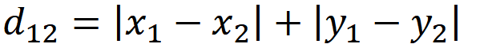

2、欧几里得距离
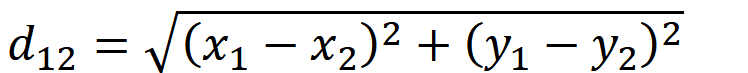

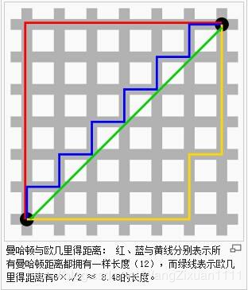

三、K-means中的k值如何选取
=================

1、手肘法
-----

手肘法的核心指标是SSE(sum of the squared errors，误差平方和)，

其中，Ci是第i个簇，p是Ci中的样本点，mi是Ci的质心（Ci中所有样本的均值），SSE是所有样本的聚类误差，代表了聚类效果的好坏。

手肘法的核心思想是：随着聚类数k的增大，样本划分会更加精细，每个簇的聚合程度会逐渐提高，

那么误差平方和SSE自然会逐渐变小。当k小于真实聚类数时，由于k的增大会大幅增加每个

簇的聚合程度，故SSE的下降幅度会很大，而当k到达真实聚类数时，再增加k所得到的聚合程度回

报会迅速变小，所以SSE的下降幅度会骤减，然后随着k值的继续增大而趋于平缓，也就是说SSE

和k的关系图是一个手肘的形状，而这个肘部对应的k值就是数据的真实聚类数。当然，这也是该

方法被称为手肘法的原因。

具体做法是让k从1开始取值直到取到你认为合适的上限(一般来说这个上限不会太大，这里我们选取上限为8)，对每一个k值进行聚类并且记下对于的SSE，最后选取肘部对应的k作为我们的最佳聚类数。

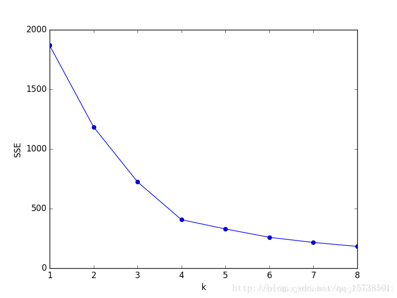

2\. 轮廓系数法（越大越好）
---------------

该方法的核心指标是轮廓系数（Silhouette Coefficient），某个样本点Xi的轮廓系数定义如下：

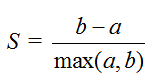

其中，a是Xi与同簇的其他样本的平均距离，称为凝聚度，b是Xi与最近簇中所有样本的平均距离，称为分离度。而最近簇的定义是

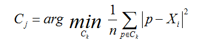

其中p是某个簇Ck中的样本。事实上，简单点讲，就是用Xi到某个簇所有样本平均距离作为衡量该点到该簇的距离后，选择离Xi最近的一个簇作为最近簇。

求出所有样本的轮廓系数后再求平均值就得到了平均轮廓系数。平均轮廓系数的取值范围为[-1,1]，且簇内样本的距离越近，簇间样本距离越远，平均轮廓系数越大，聚类效果越好。那么，很自然地，平均轮廓系数最大的k便是最佳聚类数。

K-means算法的优点和缺点是什么？
-------------------

K-Means的主要优点：

（1）原理简单，容易实现

（2）可解释度较强

K-Means的主要缺点：

（1）K值很难确定

（2）局部最优

（3）对噪音和异常点敏感

（4）需样本存在均值（限定数据种类）

（5）聚类效果依赖于聚类中心的初始化

（6）对于非凸数据集或类别规模差异太大的数据效果不好

###### K-means是否会一直陷入选择质心的循环停不下来？

（1）迭代次数设置
（2）设定收敛判断距离

DBSCAN
------

检测异常和离群点用DBSCAN

DBSCAN 算法是一种基于密度的聚类算法：
 1.聚类的时候不需要预先指定簇的个数
 2.最终的簇的个数不确定
DBSCAN算法将数据点分为三类：
 1.核心点：在半径Eps内含有超过MinPts数目的点。
 2.边界点：在半径Eps内点的数量小于MinPts,但是落在核心点的邻域内的点。
 3.噪音点：既不是核心点也不是边界点的点。

如下图所示：图中黄色的点为边界点，因为在半径Eps内，它领域内的点不超过MinPts个，我们这里设置的MinPts为5；而中间白色的点之所以为核心点，是因为它邻域内的点是超过MinPts（5）个点的

### 2.DBSCAN算法的流程

1.将所有点标记为核心点、边界点或噪声点；
2.删除噪声点；
3.为距离在Eps之内的所有核心点之间赋予一条边；
4.每组连通的核心点形成一个簇；
5.将每个边界点指派到一个与之关联的核心点的簇中（哪一个核心点的半径范围之内）。

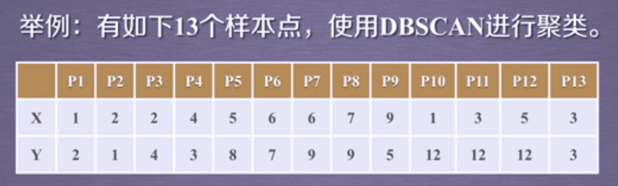

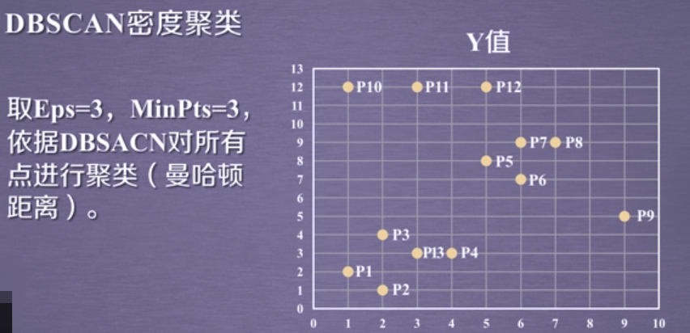

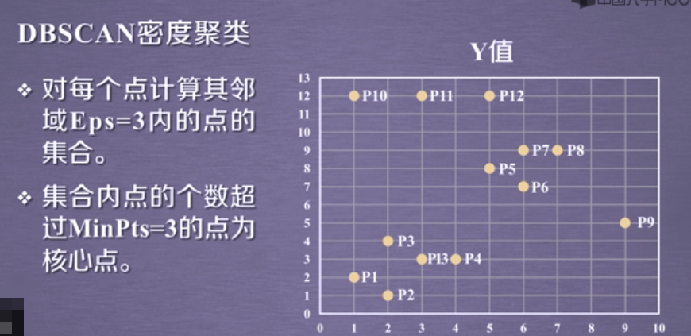

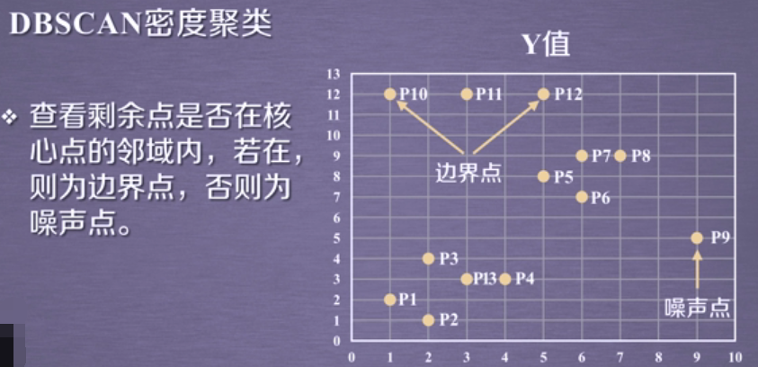

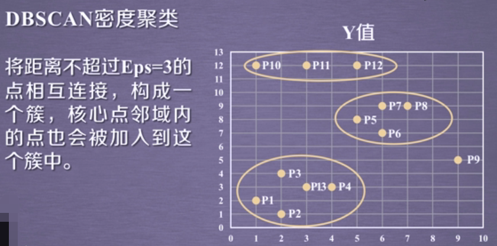