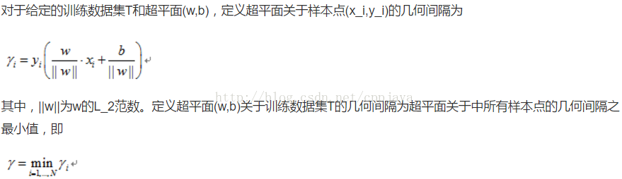
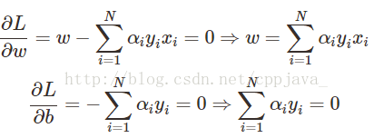
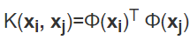

b. 只通过几个支持向量就确定了超平面，说明它不在乎细枝末节，所以不容易过拟合，但不能确保一定不会过拟合。可以处理复杂的非线性问题。 
d. 缺点：计算量大 

它的基本模型是定义在特征空间上的能够正确划分训练数据集并且几何间隔最大的线性分类器。支持向量机还包括核技巧，这使它成为实质上的非线性分类器。支持向量机的学习策略就是间隔最大化，可形式化为一个求解凸二次规划的问题,支持向量机的学习算法是求解凸二次规划的最优化算法。
-----------------------------------------------------------------------------------------------------------------------------------

算法推导过程：
-------

（1）代价函数：假设正类样本y =wTx+ b\>=+1,负类样本y =wTx+ b\<=-1,两条边界之间的距离为2/||w||，最大化这个距离，应该最小化||w||，约束条件的目的是为了保证正类样本位于H1右边，负类样本位于H2左边，所以原始的代价函数就为：
-----------------------------------------------------------------------------------------------------------------------------------

{W′→Xi→+b≥+1,yi=+1W′→Xi→+b≤−1,yi=−1}
W′X

 w的L2范数

函数间隔（functional margin）:
------------------------

几何间隔（geometric margin）:
-----------------------

（2）对偶问题：引入拉格朗日乘子，可以得到以下拉格朗日函数:
------------------------------

求导：

将上式代入拉格朗日函数：

由于对偶问题的性质，最小变为最大，求W的极值即可：



从KKT条件中得到，只有支持向量的不为0，其他情况的都为0.那么来一个新样本x后，就可以这样分类：

 

为什么要转为对偶问题？
-----------

(a) 目前处理的模型严重依赖于数据集的维度d，如果维度d太高就会严重提升运算时间；

(b) 对偶问题事实上把SVM从依赖d个维度转变到依赖N个数据，考虑到在最后计算时只有支持向量才有意义，所以这个计算量实际上比N小很多。

（3）松弛向量与软间隔最大化：
---------------

原因：一些离群点或者噪声点影响分界面；

解决方法：允许某些样本不满足约束:

新模型：

解释：引入松弛变量后，就允许某些样本点的函数间隔小于1，即在最大间隔区间里面，或者函数间隔是负数，即样本点在对方的区域中。C是离群点的权重，值越大说明离群点对目标函数影响越大，这时候间隔就会很小。

相应的对偶问题求解：

求导：

带入得到对偶优化问题（发现与之前模型只多了一个小于等于C的限制条件）：

(4)核函数
======

原因：原始空间线性不可分，可以使用一个非线性映射将原始数据x变换到另一个高维特征空间，在这个空间中，样本变得线性可分。

解决方法：常用的一般是径向基RBF函数（线性核，高斯核，拉普拉斯核等）。

优点：避免了高维空间的计算，计算核函数的复杂度和计算原始样本内积的复杂度没有实质性的增加。

（5）多分类

一对多方法：每一次把某个样本定为正样本，其余样本作为负样本。

 优点：每个优化问题规模小，分类器少，分类速度快；

 缺点：每一个分类器都说它属于它那一类---分类重叠；每一个分类器都说它不是它那一类---不可分类现象。

一对一方法：每次选一个类的样本作正类样本，负类样本则变成只选一个类。

 优点:不会出现分类重叠现象。

(6) SMO算法实现SVM

基本思想：将大优化的问题分解成多个小优化问题，这些小问题往往比较容易求解，并且对他们进行顺序求解的结果与他们作为整体来求解的结果完全一致。

过程：

常见问题：

(7)总结：

支持向量机的基本思想可以概括为，首先通过非线性变换将输入空间变换到一个高维的空间，然后在这个新的空间求最优分类面即最大间隔分类面，而这种非线性变换是通过定义适当的内积核函数来实现的。SVM实际上是根据统计学习理论依照结构风险最小化的原则提出的，要求实现两个目的：

1）两类问题能够分开（经验风险最小）

2）margin最大化（风险上界最小）既是在保证风险最小的子集中选择经验风险最小的函数。

Dm=|W′x→+b|||W→||

2.SVM为什么采用间隔最大化？
----------------

当训练数据线性可分时，存在无穷个分离超平面可以将两类数据正确分开。利用间隔最大化求得最优分离超平面，这时，解是唯一的。另一方面，此时的分隔超平面所产生的分类结果对未知实例的泛化能力最强。

 3.为什么要将求解SVM的原始问题转换为其对偶问题？
---------------------------

是对偶问题往往更易求解,（当我们寻找约束存在时的最优点的时候，约束的存在虽然减小了需要搜寻的范围，但是却使问题变得更加复杂。为了使问题变得易于处理，我们的方法是把目标函数和约束全部融入一个新的函数，即拉格朗日函数，再通过这个函数来寻找最优点。）
(a)目前处理的模型严重依赖于数据集的维度d，如果维度d太高就会严重提升运算时间；
(b)对偶问题把SVM从依赖d个维度转变到依赖N个数据点，最后计算时只有支持向量有意义，所以计算量比N小很多。

4.为什么SVM要引入核函数？
---------------

当样本在原始空间线性不可分时，可将样本从原始空间映射到一个更高维的特征空间，使得样本在这个特征空间内线性可分。

引入映射后的对偶问题：

在学习预测中，只定义核函数K(x,y)，而不是显式的定义映射函数ϕ。因为特征空间维数可能很高，甚至可能是无穷维，因此直接计算ϕ(x)·ϕ(y)是比较困难的。相反，直接计算K(x,y)比较容易（即直接在原来的低维空间中进行计算，而不需要显式地写出映射后的结果）。
核函数的定义：K(x,y)=\<ϕ(x),ϕ(y)\>，即在特征空间的内积等于它们在原始样本空间中通过核函数K计算的结果。

5.svm RBF核函数的具体公式？
------------------

f(x(i))=e(−2σ2∣∣xi​−li​∣∣2​)

Gauss径向基函数则是局部性强的核函数，其外推能力随着参数σ的增大而减弱。

这个核会将原始空间映射为无穷维空间。不过，如果 σ 选得很大的话，高次特征上的权重实际上衰减得非常快，所以实际上相当于一个低维的子空间；反过来，如果 σ 选得很小，则可以将任意的数据映射为线性可分——当然这并不一定是好事，因为随之而来的可能是非常严重的过拟合问题。通过调控参数σ ，高斯核实际上具有相当高的灵活性，也是使用最广泛的核函数之一。

6.为什么SVM对缺失数据敏感？
----------------

SVM没有处理缺失值的策略（决策树有）。而SVM希望样本在特征空间中线性可分，所以特征空间的好坏对SVM的性能很重要。缺失特征数据将影响训练结果的好坏。

8.SVM如何处理多分类问题？
---------------

一般有两种做法：
一种是直接法，直接在目标函数上修改，将多个分类面的参数求解合并到一个最优化问题里面。看似简单但是计算量却非常的大。

另外一种做法是间接法：对训练器进行组合。其中比较典型的有一对一，和一对多。

一对多，就是对每个类都训练出一个分类器，由svm是二分类，所以将此而分类器的两类设定为目标类为一类，其余类为另外一类。这样针对k个类可以训练出k个分类器，当有一个新的样本来的时候，用这k个分类器来测试，那个分类器的概率高，那么这个样本就属于哪一类。这种方法效果不太好，bias比较高。

一对一法（one-vs-one），针对任意两个类训练出一个分类器，如果有k类，一共训练出C(2,k) 个分类器，这样当有一个新的样本要来的时候，用这C(2,k) 个分类器来测试，每当被判定属于某一类的时候，该类就加一，最后票数最多的类别被认定为该样本的类。

DAG法：用一对一的方法建立k(k-1)/2个分类器，然后将这些分类器建立成有向无环图(有点像二叉树)；预测的时候，都只需要调用k-1个分类器；缺点是存在错误累积，一旦开始分类错的话，接下来就不可能分对了。所以第一个分类器一定要选好

10、样本失衡会对SVM的结果产生影响吗？
---------------------

答：会，超平面会靠近样本少的类别。因为使用的是软间隔分类，而如果对所有类别都是使用同样的惩罚系数，则由于优化目标里面有最小化惩罚量，所以靠近少数样本时，其惩罚量会少一些。比如：假设理想的分隔超平面是大样本中有很多数据到该超平面的函数距离是小于1的，而小样本中是只有少数样本的函数距离小于1的。但是由于惩罚系数相同，实际算法得到的超平面会往小样本数据靠近。

1)、对多数类和和少数类采用不同的惩罚因子，对正例和负例赋予不同的C值，例如正例远少于负例，则正例的C值取得较大，这种方法的缺点是可能会偏离原始数据的概率分布；

2)、对训练集的数据进行预处理即对数量少的样本以某种策略进行采样，增加其数量或者减少数量多的样本，典型的方法如：随机插入法，缺点是可能出现 overfitting，较好的是：Synthetic Minority Over-sampling TEchnique(SMOTE)，其缺点是只能应用在具体的特征空间中，不适合处理那些无法用特征向量表示的问题，当然增加样本也意味着训练时间可能增加；

3)、基于核函数的不平衡数据处理。

11、样本失衡时，如何评价分类器的性能好坏？
----------------------

答：使用ROC曲线

16、如何选择核函数？
-----------

线性核是高斯核的特例，对于特征非常多的情况下，应使用线性核。因为此时特征够用了(很大可能是线性问题)，没必要映射到更高维的特征空间,线性核的训练速度快，而且一般情况下效果还不错，尤其是维度高的情况下。
sigmoid核在给定的参数下和高斯核相似
多项式核的参数太多；对于高斯核0\<Kij\<1，而多项式核则可能会出现无穷大或无穷小；
其他核需要调参（使用交叉验证），所以速度慢。

高斯核必然映射到无穷维，因为核函数的泰勒展开有无穷多项。

17、为什么SVM训练的时候耗内存，而预测的时候占内存少？
-----------------------------

答：因为SVM训练过程中需要存储核矩阵。而预测的时候只需要存储支持向量和相关参数。

详细回答：算法最耗时的地方是优化乘子的选择和更新一阶导数信息，这两个地方都需要去计算核函数值，而核函数值的计算最终都需要去做内积运算，这就意味着原始空间的维度很高会增加内积运算的时间；对于dense matrix我就直接用numpy的dot了，而sparse matrix采用的是CSR表示法，求它的内积我实验过的方法有三种，第一种不需要额外空间，但时间复杂度为O(nlgn)，第二种需要一个hash表(用dictionary代替了)，时间复杂度为线性，第三种需要一个bitmap(使用BitVector)，时间复杂度也为线性，实际使用中第一种速度最快，我就暂时用它了，应该还有更快的方法，希望高人们能指点一下；另外由于使用dictionary缓存核矩阵，遇到训练数据很大的数据集很容易挂掉，所以在程序中，当dictionary的内存占用达到配置文件的阈值时会将其中相对次要的元素删掉，保留对角线上的内积值。

18、在SMO中，什么叫违反KKT条件最严重的？
------------------------

答：每一个α对应一个样本，而KKT条件是样本和对应的α应该满足的关系。所谓违反最严重是指α对应的样本错得最离谱

19、SVM适合处理什么样的数据？
-----------------

答：高维稀疏，样本少。【参数只与支持向量有关，数量少，所以需要的样本少，由于参数跟维度没有关系，所以可以处理高维问题】高维问题还可以另外一个角度来思考，假设给定一个训练数据集，其特征是少量的，那么很可能需要映射到高维空间才能求解，那么这个问题就是一个高维问题

20、线性核VS多项式核VS径向基核？
-------------------

1）训练速度：线性核只需要调节惩罚因子一个参数，所以速度快；多项式核参数多，难调;径向基核函数还需要调节γ,需要计算e的幂，所以训练速度变慢。【调参一般使用交叉验证，所以速度会慢】

2）训练结果：线性核的得到的权重w可以反映出特征的重要性，从而进行特征选择；多项式核的结果更加直观，解释性强;径向基核得到权重是无法解释的。

3）适应的数据：线性核：样本数量远小于特征数量(n\<\<m，或者样本数量与特征数量都很大；径向基核：样本数量远大于特征数量(n\>\>m)

缺点：使用大量存储空间

优点：