**一、分类问题**

1、混淆矩阵
------

混淆矩阵是监督学习中的一种可视化工具，主要用于比较分类结果和实例的真实信息。矩阵中的每一行代表实例的预测类别，每一列代表实例的真实类别。

 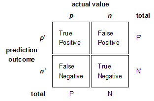

    真正(True Positive , TP)：被模型预测为正的正样本。 假正(False Positive , FP)：被模型预测为正的负样本。 假负(False Negative , FN)：被模型预测为负的正样本。 真负(True Negative , TN)：被模型预测为负的负样本。 真正率(True Positive Rate,TPR)：TPR=TP/(TP+FN)，即被预测为正的正样本数 /正样本实际数。 假正率(False Positive Rate,FPR) ：FPR=FP/(FP+TN)，即被预测为正的负样本数 /负样本实际数。 假负率(False Negative Rate,FNR) ：FNR=FN/(TP+FN)，即被预测为负的正样本数 /正样本实际数。 真负率(True Negative Rate,TNR)：TNR=TN/(TN+FP)，即被预测为负的负样本数 /负样本实际数/2

**2、准确率（Accuracy）**

准确率是最常用的分类性能指标。
Accuracy = (TP+TN)/(TP+FN+FP+TN)

即正确预测的正反例数 /总数

**3、精确率（Precision）**

精确率容易和准确率被混为一谈。其实，精确率只是针对预测正确的正样本而不是所有预测正确的样本。表现为预测出是正的里面有多少真正是正的。可理解为查准率。
Precision = TP/(TP+FP)

即正确预测的正例数 /预测正例总数

**4、召回率（Recall）**

召回率表现出在实际正样本中，分类器能预测出多少。与真正率相等，可理解为查全率。
Recall = TP/(TP+FN)，即正确预测的正例数 /实际正例总数

**5、F1 score**

F值是精确率和召回率的调和值，更接近于两个数较小的那个，所以精确率和召回率接近时，F值最大。很多推荐系统的评测指标就是用F值的。
2/F1 = 1/Precision + 1/Recall

**6、ROC曲线**

逻辑回归里面，对于正负例的界定，通常会设一个阈值，大于阈值的为正类，小于阈值为负类。如果我们减小这个阀值，更多的样本会被识别为正类，提高正类的识别率，但同时也会使得更多的负类被错误识别为正类。为了直观表示这一现象，引入ROC。根据分类结果计算得到ROC空间中相应的点，连接这些点就形成ROC curve，横坐标为False Positive Rate(FPR假正率)，纵坐标为True Positive Rate(TPR真正率)。一般情况下，这个曲线都应该处于(0,0)和(1,1)连线的上方,如图：

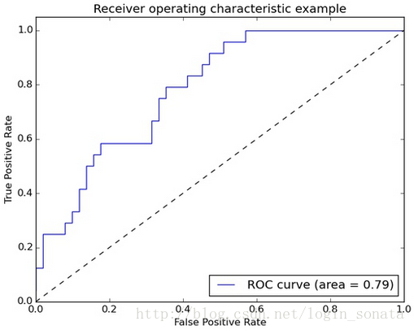

    ROC曲线中的四个点和一条线: 点(0,1)：即FPR=0, TPR=1，意味着FN＝0且FP＝0，将所有的样本都正确分类。 点(1,0)：即FPR=1，TPR=0，最差分类器，避开了所有正确答案。 点(0,0)：即FPR=TPR=0，FP＝TP＝0，分类器把每个实例都预测为负类。 点(1,1)：分类器把每个实例都预测为正类。 总之：ROC曲线越接近左上角，该分类器的性能越好。而且一般来说，如果ROC是光滑的，那么基本可以判断没有太大的overfitting

**7、AUC**

AUC（Area Under Curve）被定义为ROC曲线下的面积(ROC的积分)，通常大于0.5小于1。随机挑选一个正样本以及一个负样本，分类器判定正样本的值高于负样本的概率就是 AUC 值。AUC值(面积)越大的分类器，性能越好，如图：

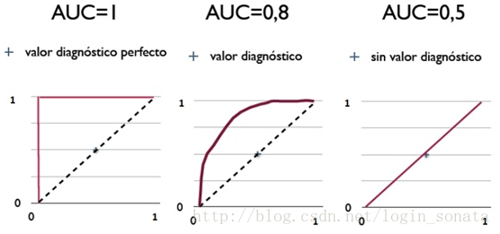

**8、PR曲线**

PR曲线的横坐标是精确率P，纵坐标是召回率R。评价标准和ROC一样，先看平滑不平滑（蓝线明显好些）。一般来说，在同一测试集，上面的比下面的好（绿线比红线好）。当P和R的值接近时，F1值最大，此时画连接(0,0)和(1,1)的线，线和PRC重合的地方的F1是这条线最大的F1（光滑的情况下），此时的F1对于PRC就好像AUC对于ROC一样。一个数字比一条线更方便调型。

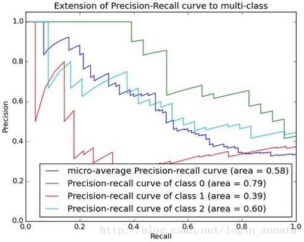

    有时候模型没有单纯的谁比谁好（比如图二的蓝线和青线），所以选择模型还是要结合具体的使用场景。下面是两个场景： 1，地震的预测 对于地震的预测，我们希望的是RECALL非常高，也就是说每次地震我们都希望预测出来。这个时候我们可以牺牲PRECISION。情愿发出1000次警报，把10次地震都预测正确了，也不要预测100次对了8次漏了两次。 2，嫌疑人定罪 基于不错怪一个好人的原则，对于嫌疑人的定罪我们希望是非常准确的。即时有时候放过了一些罪犯（recall低），但也是值得的。 对于分类器来说，本质上是给一个概率，此时，我们再选择一个CUTOFF点（阀值），高于这个点的判正，低于的判负。那么这个点的选择就需要结合你的具体场景去选择。反过来，场景会决定训练模型时的标准，比如第一个场景中，我们就只看RECALL=99.9999%（地震全中）时的PRECISION，其他指标就变得没有了意义。
    当正负样本数量差距不大的情况下，ROC和PR的趋势是差不多的，但是在正负样本分布极不均衡的情况下，PRC比ROC更能真实的反映出实际情况，因为此时ROC曲线看起来似乎很好，但是却在PR上效果一般。

**二、回归问题**

拟合（回归）问题比较简单，所用到的衡量指标也相对直观。假设yiyi是第ii个样本的真实值，ŷ iy^i是对第ii个样本的预测值。

1\. 平均绝对误差（MAE）
---------------

平均绝对误差MAE（Mean Absolute Error）又被称为l1范数损失（l1-norm loss）：

 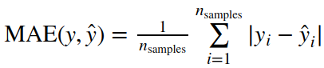

2\. 平均平方误差（MSE）
---------------

平均平方误差MSE（Mean Squared Error）又被称为l2范数损失（l2-norm loss）：

 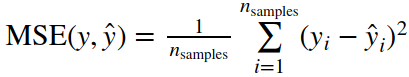

**3、均方根误差（RMSE）**

RMSE虽然广为使用，但是其存在一些缺点，因为它是使用平均误差，而平均值对异常点（outliers）较敏感，如果回归器对某个点的回归值很不理性，那么它的误差则较大，从而会对RMSE的值有较大影响，即平均值是非鲁棒的。

**4、解释变异**

解释变异（ Explained variance）是根据误差的方差计算得到的：

 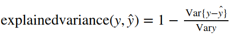

5、决定系数
------

决定系数（Coefficient of determination）又被称为R2分数：

 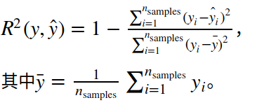

**三、聚类**

1 . 兰德指数
--------

兰德指数（Rand index）需要给定实际类别信息C，假设K是聚类结果，a表示在C与K中都是同类别的元素对数，b表示在C与K中都是不同类别的元素对数，则兰德指数为：

 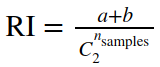

其中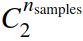数据集中可以组成的总元素对数，RI取值范围为[0,1]，值越大意味着聚类结果与真实情况越吻合。

对于随机结果，RI并不能保证分数接近零。为了实现“在聚类结果随机产生的情况下，指标应该接近零”，调整兰德系数（Adjusted rand index）被提出，它具有更高的区分度：

 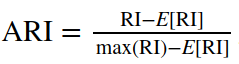

具体计算方式参见[Adjusted Rand index](https://en.wikipedia.org/wiki/Rand_index#Adjusted_Rand_index)。

ARI取值范围为[−1,1]，值越大意味着聚类结果与真实情况越吻合。从广义的角度来讲，ARI衡量的是两个数据分布的吻合程度。

2\. 互信息
-------

互信息（Mutual Information）也是用来衡量两个数据分布的吻合程度。假设UU与VV是对NN个样本标签的分配情况，则两种分布的熵（熵表示的是不确定程度）分别为：

 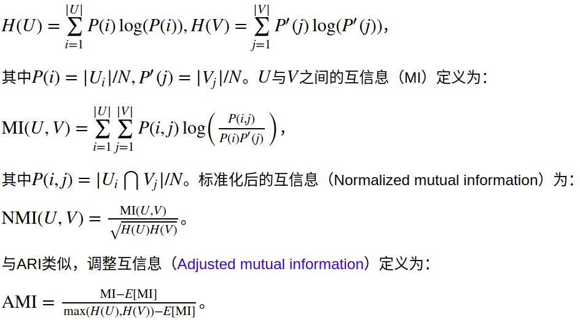

利用基于互信息的方法来衡量聚类效果需要实际类别信息，MI与NMI取值范围为[0,1]，AMI取值范围为[−1,1]，它们都是值越大意味着聚类结果与真实情况越吻合。

3\. 轮廓系数
--------

轮廓系数（Silhouette coefficient）适用于实际类别信息未知的情况。对于单个样本，设aa是与它同类别中其他样本的平均距离，bb是与它距离最近不同类别中样本的平均距离，轮廓系数为：

 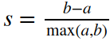

对于一个样本集合，它的轮廓系数是所有样本轮廓系数的平均值。

轮廓系数取值范围是[−1,1]