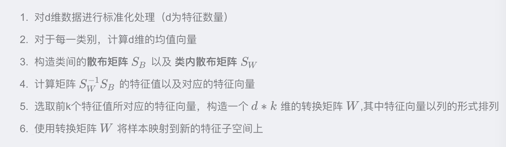

PCA的主要思想是将n维特征映射到k维上，这k维是全新的正交特征也被称为主成分，是在原有n维特征的基础上重新构造出来的k维特征。

PCA的工作就是从原始的空间中顺序地找一组相互正交的坐标轴，新的坐标轴的选择与数据本身是密切相关的。其中，第一个新坐标轴选择是原始数据中方差最大的方向，第二个新坐标轴选取是与第一个坐标轴正交的平面中使得方差最大的，第三个轴是与第1,2个轴正交的平面中方差最大的。依次类推，可以得到n个这样的坐标轴。通过这种方式获得的新的坐标轴，我们发现，大部分方差都包含在前面k个坐标轴中，后面的坐标轴所含的方差几乎为0。于是，我们可以忽略余下的坐标轴，只保留前面k个含有绝大部分方差的坐标轴。事实上，这相当于只保留包含绝大部分方差的维度特征，而忽 略包含方差几乎为0的特征维度，实现对数据特征的降维处理。

通过计算数据矩阵的协方差矩阵，然后得到协方差矩阵的特征值特征向量，选择特征值最大(即方差最大)的k个特征所对应的特征向量组成的矩阵。这样就可以将数据矩阵转换到新的空间当中，实现数据特征的降维。

LDA

线性判别分析属于有监督学习算法

LDA的思想非常朴素：将带上标签数据(点)，通过投影(变换)的方法，投影更低维的空间。在这个低维空间中，同类样本尽可能接近，异类样本尽可能远离。

欲使同类样本的投影点尽可能接近，可以让同类样本的投影点的协方差尽可能小；而欲使异类样本的投影点尽可能远离，可以让异类样本的类中心之间的距离尽可能大。

* LDA关键步骤：

  