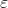

1\. 概念
======

线性回归（Linear Regression）是一种通过属性的线性组合来进行预测的线性模型，其目的是找到一条直线或者一个平面或者更高维的超平面，使得预测值与真实值之间的误差最小化。

2\. 特点
======

1. 优点：结果具有很好的可解释性（w直观表达了各属性在预测中的重要性），计算熵不复杂。
2. 缺点：对非线性数据拟合不好
3. 适用数据类型：数值型和标称型数据

3\. 原理与推导
=========

1\. 给定数据集，其中，（线性回归的输出空间是整个实数空间）。是样本数，是属性维度。

线性回归试图学得：

  （1），使得。

为便于讨论，使，其中。此时，就成为了，就成为了，期望学得的函数为。

2\. 预测值和真实值之间都肯定存在差异，对于每个样本：

  （2）

假设误差是独立同分布的，并且服从高斯分布。即：

  （3）

将（2）代入（3）中，得到在已知参数和数据的情况下，预测值为的条件概率：

  （4）

3\. 将（4）连乘得到在已知参数和数据的情况下，预测值为的条件概率，这个条件概率在数值上等于，likelihood（w|x,y），也就是在已知现有数据的条件下，w是真正参数的概率，即似然函数（5）：

  （5）

为什么要引入似然函数：为了根据样本估计参数值。极大化似然函数

为什么要对似然函数进行log变换：由于乘法难解，通过对数可以将乘法转换为加法，简化计算。

对数似然函数：

 ![\\begin{array}{l} \\ell\\left( w \\right) = \\log \\prod\\limits\_{i = 1}^m {\\frac{1}{{\\sqrt {2\\pi } \\sigma }}} \\exp \\left( { - \\frac{{{{\\left( {{y\_i} - {w^T}{x\_i}} \\right)}^2}}}{{2{\\sigma ^2}}}} \\right)\\\\ = \\sum\\limits\_{i = 1}^m {\\log \\frac{1}{{\\sqrt {2\\pi } \\sigma }}} \\exp \\left( { - \\frac{{{{\\left( {{y\_i} - {w^T}{x\_i}} \\right)}^2}}}{{2{\\sigma ^2}}}} \\right)\\\\ = \\sum\\limits\_{i = 1}^m {\\log \\frac{1}{{\\sqrt {2\\pi } \\sigma }}} + \\sum\\limits\_{i = 1}^m {log\\left( {\\exp \\left( { - \\frac{{{{\\left( {{y\_i} - {w^T}{x\_i}} \\right)}^2}}}{{2{\\sigma ^2}}}} \\right)} \\right)} \\\\ = m\\log \\frac{1}{{\\sqrt {2\\pi } \\sigma }} - \\sum\\limits\_{i = 1}^m {\\frac{{{{\\left( {{y\_i} - {w^T}{x\_i}} \\right)}^2}}}{{2{\\sigma ^2}}}} \\\\ = m\\log \\frac{1}{{\\sqrt {2\\pi } \\sigma }} - \\frac{1}{{{\\sigma ^2}}}\\frac{1}{2}\\sum\\limits\_{i = 1}^m {{{\\left( {{y\_i} - {w^T}{x\_i}} \\right)}^2}} \\end{array}](机器学习/resources/50A11DC69623413ABC36C46D72E4787C.gif) （6）

得到目标函数：

 ![J(w) = \\frac{1}{2}\\sum\\limits\_{i = 1}^m {{{\\left( {{y\_i} - {w^T}{x\_i}} \\right)}^2}} \\\\ = \\frac { 1 } { 2 } \\left\\| \\left[ \\begin{array} { c } { y \_ { 1 } - w ^ { T } x \_ { 1 } } \\\\ { y \_ { 2 } - w ^ { T } x \_ { 2 } } \\\\ { \\cdots } \\\\ { y \_ { m } - w ^ { T } x \_ { m } } \\end{array} \\right] \\right\\| ^ { 2 }= \\frac { 1 } { 2 } \\left\\| \\left[ \\begin{array} { l } { y \_ { 1 } } \\\\ { y \_ { 2 } } \\\\ { \\cdots } \\\\ { y \_ { m } } \\end{array} \\right] - w ^ { T } \\left[ \\begin{array} { c } { x \_ { 1 } } \\\\ { x \_ { 2 } } \\\\ { \\cdots } \\\\ { x \_ { m } } \\end{array} \\right] \\right\\| ^ { 2 } \\\\ = \\frac{1}{2}{\\left\\| {y - {w^T}X} \\right\\|^2} = \\frac{1}{2}{\\left( {y - {w^T}x} \\right)^T}\\left( {y - {w^T}x} \\right)](机器学习/resources/CA3EC9356B3F5A3B1847E2BE04E2C6AD.gif) （7）（最小二乘法）

 使所有点到曲线的方差最小.利用最小二乘对扫描线上的所有数据点进行拟合,得到一条样条曲线,然后逐点计算每一个点Pi到样条曲线的欧拉距离ei（即点到曲线的最短距离）,ε是距离的阈值，事先给定，如果ei≥ε，则将该点判断为噪点.

为什么要让目标函数越小越好：似然函数表示样本成为真实的概率，似然函数越大越好，也就是目标函数越小越好。

4\. 目标函数是凸函数，只要找到一阶导数为0的位置，就找到了最优解。

因此求偏导：

 ![\\begin{array}{l} \\frac{{\\partial J\\left( w \\right)}}{{\\partial w}} = \\frac{1}{2}\\frac{\\partial }{{\\partial w}}\\left( {{{\\left( {y - {w^T}x} \\right)}^T}\\left( {y - {w^T}x} \\right)} \\right)\\\\ = \\frac{1}{2}\\frac{\\partial }{{\\partial w}}\\left( {{{\\left( {y - Xw} \\right)}^T}\\left( {y - Xw} \\right)} \\right)\\\\ = \\frac{1}{2}\\frac{\\partial }{{\\partial w}}\\left( {{w^T}{X^T}Xw - 2{w^T}Xy + {y^T}y} \\right)\\\\ {\\rm{ = }}\\frac{1}{2}\\left( {{X^T}Xw{\\rm{ + }}{X^T}Xw{\\rm{ - }}2Xy} \\right)\\\\ {\\rm{ = }}{X^T}Xw{\\rm{ - }}Xy \\end{array}](机器学习/resources/EE2C3DFC779640E6978B86C521D3AFC3.gif) （8）

5\. 令偏导等于0：

  （9）

得到：

  （10）

情况一：可逆，唯一解。令公式（10）为零可得最优解为：

  （11）

 学得的线性回归模型为:

  （12）

情况二：不可逆，可能有多个解。选择哪一个解作为输出，将有学习算法的偏好决定，常见的做法是增加扰动。

  （13）

4\. 算法描述
--------

1\. 从数据集D出发，构建输入矩阵X和输出向量y。

 ![X = \\left[ \\begin{array} { c } { x \_ { 1 } ^ { T } } \\\\ { x \_ { 2 } ^ { T } } \\\\ { \\cdots } \\\\ { x \_ { m } ^ { T } } \\end{array} \\right] \\quad y = \\left[ \\begin{array} { c } { y \_ { 1 } } \\\\ { y \_ { 2 } } \\\\ { \\dots } \\\\ { y \_ { m } } \\end{array} \\right]](机器学习/resources/1A893A3B4CBDB2124F61B9C286026B33.gif) 

2\. 计算伪逆（pseudo-inverse）。

3. 返回，学得的线性回归模型为。

5\. 广义线性回归
----------

当不再只是线性回归中用到的正态分布，而是扩大为指数族中的任一分布。这样得到的模型称为“广义线性模型”（generalized linear model）：

 

其中函数称为“联系函数”（link function）。