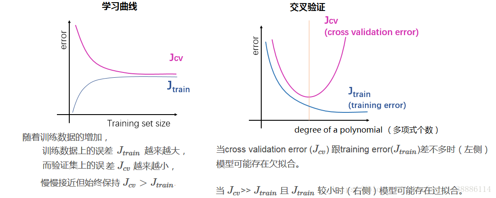
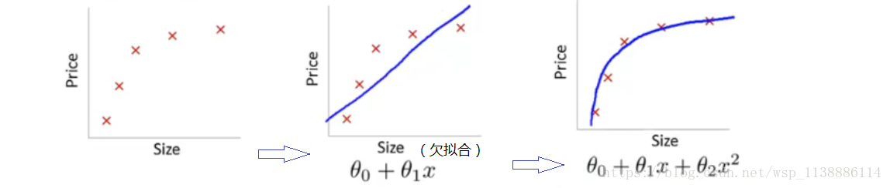
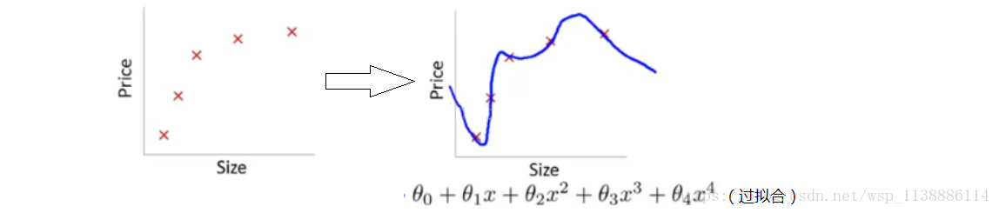

一般提及到过拟合就是说在训练集上模型表现很好，但是在测试集上效果很差，即模型的泛化能力不行。过拟合是模型训练过程中参数拟合的问题，由于训练数据本身有采样误差，拟合模型参数时这些采样误差都拟合进去就会带来所谓的过拟合问题。

1 过拟合原因

（1）建模样本抽取错误，包括（但不限于）样本数量太少，抽样方法错误， 抽样时没有足够正确考虑业务场景或业务特点，不能有效足够代表业务逻辑或业务场景。

（2）样本里的噪音数据干扰过大，模型学习了噪音特征，反而忽略了真实的输入输出间的关系。

（3）建模时的“逻辑假设”到了模型应用时已经不能成立了。 任何预测模型都是在假设的基础上才可以搭建和应用的。常用的假设包括：

假设历史数据可以推测未来，

假设业务环节没有发生显著变化，

假设建模数据与后来的应用数据是相似的，等等。

如果上述假设违反了业务场景的话，根据这些假设搭建的模型当然是无法有效应用的。

（4）参数太多、模型复杂度高。

（5）决策树模型。

如果我们对于决策树的生长没有合理的限制和修剪的话， 决策树的自由生长有可能每片叶子里只包含单纯的事件数据(event)或非事件数据（no event）， 可以想象，这种决策树当然可以完美匹配（拟合）训练数据， 但是一旦应用到新的业务真实数据时，效果是一塌糊涂。

（6）神经网络模型。

由于对样本数据,可能存在隐单元的表示不唯一，即产生的分类的决策面不唯一，随着学习的进行, BP算法使权值可能收敛过于复杂的决策面，并至极致。

权值学习迭代次数足够多(Overtraining)，拟合了训练数据中的噪声和训练样例中没有代表性的特征.

##### 3 欠拟合–解决方法

首先欠拟合就是模型没有很好地捕捉到数据特征，不能够很好地拟合数据。

解决方法：

添加其他特征项，模型出现欠拟合的时候是因为特征项不够导致的，可以添加其他特征项来很好地解决。

例如，“组合”、“泛化”、“相关性”三类特征是特征添加的重要手段， 无论在什么场景，都可以照葫芦画瓢，总会得到意想不到的效果。 除上面的特征之外，“上下文特征”、“平台特征”等等，都可以作为特征添加的首选项。

添加多项式特征，例如将线性模型通过添加二次项或者三次项使模型泛化能力更强。

减少正则化参数，正则化的目的是用来防止过拟合的，当模型出现了欠拟合，则需要减少正则化参数。

##### 4 过拟合–解决方法

通俗一点地来说过拟合就是模型把数据学习的太彻底(强行拟合)，以至于把噪声数据的特征也学习到了， 这样不能够很好的分离（识别）测试数据，模型泛化能力太差。例如下面的例子：

解决方法：

1. 增大数据的训练量，之前用于训练的数据量太小导致的，训练数据占总数据的比例过小。
2. 采用正则化方法。正则化方法包括 L0正则、L1正则和L2正则， 而正则一般是在目标函数之后加上对于的范数。但是在机器学习中一般使用L2正则，下面看具体的原因。
3. 重新清洗数据，导致过拟合的一个原因也有可能是数据不纯导致的， 如果出现了过拟合就需要我们重新清洗数据。

  L0 范数是指向量中非0的元素的个数。

  L1 范数是指向量中各个元素绝对值之和，也叫“稀疏规则算子”（Lasso regularization）。

  两者都可以实现稀疏性，既然L0可以实现稀疏，为什么不用L0，而要用L1呢？个人理解一是因为L0范数很难优化求解（NP难问题）， 二是L1范数是L0范数的最优凸近似，而且它比L0范数要容易优化求解。

  L2 范数是指向量各元素的平方和然后求平方根。

  可以使得W的每个元素都很小，都接近于0， 可以使得W的每个元素都很小，都接近于0， 但与L1范数不同，它不会让它等于0，而是接近于0。L2正则项起到使得参数w变小加剧的效果，

  但是为什么可以防止过拟合呢？一个通俗的理解便是：更小的参数值w意味着模型的复杂度更低， 对训练数据的拟合刚刚好（奥卡姆剃刀），不会过分拟合训练数据，从而使得不会过拟合， 以提高模型的泛化能力。还有就是看到有人说L2范数有助于处理 condition number不好的 情况下矩阵求逆很困难的问题。

a.简化网络结构，如层数，单层神经元个数

b.early stopping，每个神经元激活函数在不同数值区间的性能是不同的，值较小时为线性区，适当增大后为非线性区，过度增大则为饱合区（梯度消失）。初始化时，神经元一般工作在线性区（拟合能力有限），训练时间增大时，部分值会增大进入非线性区（拟合能力提高），但是训练时间过大时，就会进入饱合区，神经元就“死掉”。所以应该在适当时间内就stopping训练。

c.限制权值，正则化

d.增加噪声：在输入中增加噪声（效果类似正则化）；在权值中加入噪声（非零初始化）；

3.3 集成多种模型

a.bagging，类似于分段函数的概念，不同部分的训练集使用不同模型拟合；

b.boosting，综合多个简单的模型的结果得到一个‘靠谱的结果’

c.dropout，实际效果其实是用不同的训练集训练了不同的网络模型，然后这些网络模型形成了一个整体的模型

3.4 贝叶斯方法