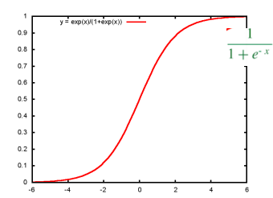
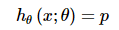
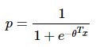
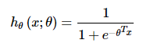
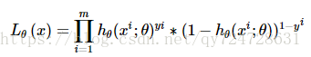

逻辑回归假设数据服从**伯努利分布**,通过极大化似然函数的方法，运用梯度下降来求解参数，来达到将数据二分类的目的。

为什么使用sigmoid函数：

1\. 可以对连续区间结果，映射到（0，1）区间，作为概率

2\. 数学特性好，易于求导

### 逻辑回归就是将线性回归的(−∞,+∞)结果，通过sigmoid函数映射到(0,1)之间。

#### 逻辑回归的损失函数

线性回归的损失函数为平方损失函数，如果将其用于逻辑回归的损失函数，则其数学特性不好，有很多局部极小值，难以用梯度下降法求最优。

* 逻辑回归的基本假设

 任何的模型都是有自己的假设，在这个假设下模型才是适用的。逻辑回归的第一个基本假设是假设数据服从伯努利分布。伯努利分布有一个简单的例子是抛硬币，抛中为正面的概率是p,抛中为负面的概率是1−p.在逻辑回归这个模型里面是假设 hθ(x)为样本为正的概率，1−hθ(x)为样本为负的概率。那么整个模型可以描述

 逻辑回归的第二个假设是假设样本为正的概率是 

 所以逻辑回归的最终形式 

* 逻辑回归的损失函数
  * 逻辑回归的损失函数是它的极大似然函数

* 逻辑回归的求解方法
  * 由于该极大似然函数无法直接求解，我们一般通过对该函数进行梯度下降来不断逼近最优解。在这个地方其实会有个加分的项，考察你对其他优化方法的了解。因为就梯度下降本身来看的话就有随机梯度下降，批梯度下降，small batch 梯度下降三种方式，面试官可能会问这三种方式的优劣以及如何选择最合适的梯度下降方式。
    * 简单来说 批梯度下降会获得全局最优解，缺点是在更新每个参数的时候需要遍历所有的数据，计算量会很大，并且会有很多的冗余计算，导致的结果是当数据量大的时候，每个参数的更新都会很慢。
    * 随机梯度下降是以高方差频繁更新，优点是使得sgd会跳到新的和潜在更好的局部最优解，缺点是使得收敛到局部最优解的过程更加的复杂。
    * \* 小批量梯度下降结合了sgd和batch gd的优点，每次更新的时候使用n个样本。减少了参数更新的次数，可以达到更加稳定收敛结果，一般在深度学习当中我们采用这种方法。

* 逻辑回归的损失函数为什么要使用极大似然函数作为损失函数？
  * 损失函数一般有四种，平方损失函数，对数损失函数，HingeLoss0-1损失函数，绝对值损失函数。将极大似然函数取对数以后等同于对数损失函数。在逻辑回归这个模型下，对数损失函数的训练求解参数的速度是比较快的。至于原因大家可以求出这个式子的梯度更新

    θj=θj−(yi−hθ(xi;θ))∗xijθj=θj−(yi−hθ(xi;θ))∗xji

这个式子的更新速度只和xijxji，yiyi相关。和sigmod函数本身的梯度是无关的。这样更新的速度是可以自始至终都比较的稳定。
  * 为什么不选平方损失函数的呢？其一是因为如果你使用平方损失函数，你会发现梯度更新的速度和sigmod函数本身的梯度是很相关的。sigmod函数在它在定义域内的梯度都不大于0.25。这样训练会非常的慢。

* 逻辑回归在训练的过程当中，如果有很多的特征高度相关或者说有一个特征重复了100遍，会造成怎样的影响？

* 先说结论，如果在损失函数最终收敛的情况下，其实就算有很多特征高度相关也不会影响分类器的效果。
* 但是对特征本身来说的话，假设只有一个特征，在不考虑采样的情况下，你现在将它重复100遍。训练以后完以后，数据还是这么多，但是这个特征本身重复了100遍，实质上将原来的特征分成了100份，每一个特征都是原来特征权重值的百分之一。
* 如果在随机采样的情况下，其实训练收敛完以后，还是可以认为这100个特征和原来那一个特征扮演的效果一样，只是可能中间很多特征的值正负相消了。

* 为什么我们还是会在训练的过程当中将高度相关的特征去掉？
  * 去掉高度相关的特征会让模型的可解释性更好
  * 可以大大提高训练的速度。如果模型当中有很多特征高度相关的话，就算损失函数本身收敛了，但实际上参数是没有收敛的，这样会拉低训练的速度。其次是特征多了，本身就会增大训练的时间。

逻辑回归的优缺点总结
----------

 在这里我们总结了逻辑回归应用到工业界当中一些优点：

* 形式简单，模型的可解释性非常好。从特征的权重可以看到不同的特征对最后结果的影响，某个特征的权重值比较高，那么这个特征最后对结果的影响会比较大。

* 模型效果不错。在工程上是可以接受的（作为baseline)，如果特征工程做的好，效果不会太差，并且特征工程可以大家并行开发，大大加快开发的速度。

* 训练速度较快。分类的时候，计算量仅仅只和特征的数目相关。并且逻辑回归的分布式优化sgd发展比较成熟，训练的速度可以通过堆机器进一步提高，这样我们可以在短时间内迭代好几个版本的模型。

* 资源占用小,尤其是内存。因为只需要存储各个维度的特征值，。

* 方便输出结果调整。逻辑回归可以很方便的得到最后的分类结果，因为输出的是每个样本的概率分数，我们可以很容易的对这些概率分数进行cutoff，也就是划分阈值(大于某个阈值的是一类，小于某个阈值的是一类)。

 但是逻辑回归本身也有许多的缺点:

* 准确率并不是很高。因为形式非常的简单(非常类似线性模型)，很难去拟合数据的真实分布。

* 很难处理数据不平衡的问题。举个例子：如果我们对于一个正负样本非常不平衡的问题比如正负样本比 10000:1.我们把所有样本都预测为正也能使损失函数的值比较小。但是作为一个分类器，它对正负样本的区分能力不会很好。

* 处理非线性数据较麻烦。逻辑回归在不引入其他方法的情况下，只能处理线性可分的数据，或者进一步说，处理二分类的问题 。

* 逻辑回归本身无法筛选特征。有时候，我们会用gbdt来筛选特征，然后再上逻辑回归。

